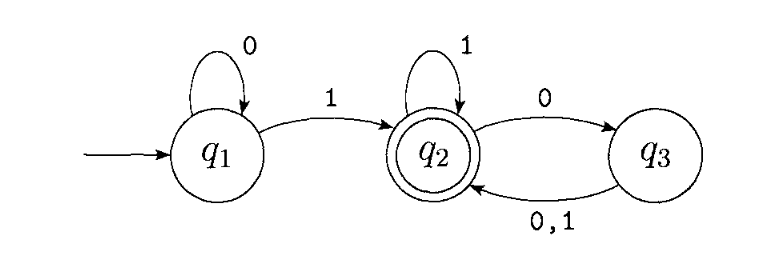

# FerrisGraph 🦀  
A fast and flexible graph library written in Rust. Supports various graph algorithms such as BFS, DFS, Dijkstra’s algorithm, and cycle detection.

Doesn't use Cloning or Copying for insertion, deletion and lookup.

## Features  
✅ Add and remove nodes & edges  
✅ Functions to access information about specific nodes, edges or the graph  
✅ Breadth-first search (BFS) & Depth-first search (DFS)  
✅ Dijkstra’s shortest path algorithm  
✅ Cycle detection  
✅ Strongly connected components (future)  
✅ More Algorithms (future)

## Installation  
You can add `ferrisgraph` to your Rust project with:  
```sh
cargo add ferrisgraph
```

## Example
This example demonstrates the ways in which this crate can be used. In this specific example, we are building a finite automata using `Graph`, and showing how we can process inputs on the data structure. The finite automata will be modelled according to the diagram. This specific finite automata can be described as the finite automata recognising $A$, where
$$A = \left{w | w \text{ contains at least one 1 and an even number of 0s follow the last 1.}\right}$$



```rust
use ferrisgraph::{graph::Graph, graph_with_nodes};

fn main() {
    // Building the Finite Automata according to the diagram

    let mut fa: Graph<&str, Vec<char>> = graph_with_nodes!("q1", "q2", "q3");

    fa.add_edge(&"q1", &"q1", Some(vec!['0']));
    fa.add_edge(&"q1", &"q2", Some(vec!['1']));

    fa.add_edge(&"q2", &"q2", Some(vec!['1']));
    fa.add_edge(&"q2", &"q3", Some(vec!['0']));

    fa.add_edge(&"q3", &"q2", Some(vec!['0', '1']));

    // Contains at least one 1, and has an even number of 0s after the final 1
    let input = "010001010000".to_string();

    // Input starts at q1
    let mut curr = "q1";

    for c in input.chars() {
        let opt = match fa.edges(&curr) {
            Ok(x) => x,
            Err(e) => panic!("{}", e),
        };

        let edges = match opt {
            Some(v) => v,
            None => panic!("There is nowhere to go from this state in the finite automata, but we still have input."),
        };

        for (dst, w) in edges {
            let weights = match w {
                Some(v) => v,
                None => continue,
            };

            if weights.contains(&c) {
                curr = *dst;
                break;
            }
        }
    }

    // Assert that after processing the input, we are left on the accept state, q2.
    assert_eq!(curr, "q2");

}

```

## 📖 Documentation  
Full documentation available at: [Docs](https://docs.rs/ferrisgraph/0.1.0/ferrisgraph/)  
`Graph` struct methods quick-link: [Docs](https://docs.rs/ferrisgraph/0.1.0/ferrisgraph/graph/graph/struct.Graph.html)  

Generate local docs with:
```sh
cargo doc --open
```
